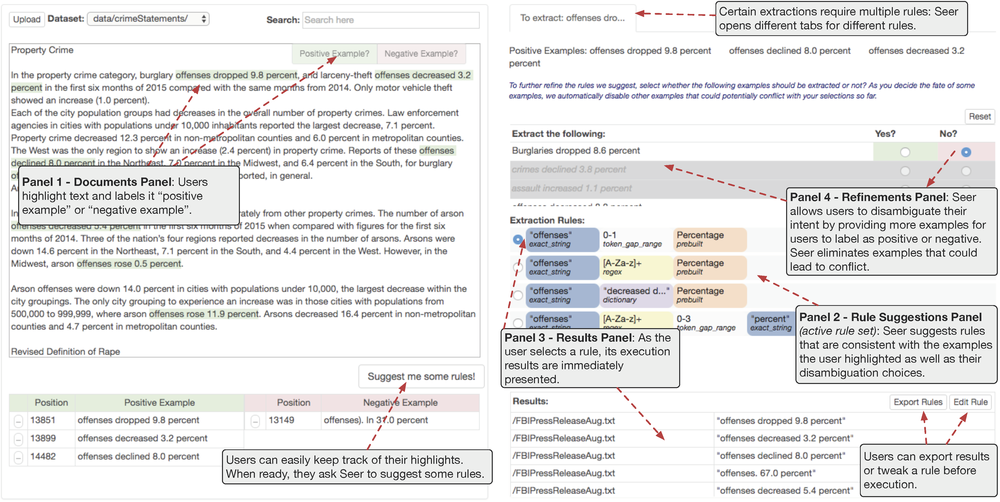

# SEER: Auto-Generating Information Extraction Rules from User-Specified Examples
Authors: Maeda F. Hanafi, Azza Abouzied, Laura Chiticariu, and Yunyao Li

##Abstract 
SEER is an end-to-end Information Extraction (IE) workflow where users highlight texts they wish to extract. Given a small set of user-specified example extractions, SEER synthesizes easy-to-understand IE rules and suggests them to the user. In addition to rule suggestions, users can quickly pick the desired rule by filtering the rule suggestion by accepting or rejecting proposed extractions. SEER's workflow allows users to jump start the IE rule development cycle; it is a less time-consuming alternative to machine learning methods that require large labeled datasets or rule-based approaches that are labor-intensive. SEER's design principles and learning algorithm are motivated by how rule developers naturally construct data extraction rules.

##Links

* [30 Sec Video Demo](https://www.youtube.com/watch?v=xF7WhkXk1Y0)
* [Longer Video Demo](https://youtu.be/3V3XRchtxRs)
* [Research Paper, CHI 2017](https://dl.acm.org/citation.cfm?id=3025540)
* [Demo Poster, SIGMOD 2017](http://maeda.herokuapp.com/pdf/SIGMODPoster.pdf)
* [Slides](https://www.slideshare.net/MaedaHanafi/seer-autogenerating-information-extraction-rules-from-userspecified-examples)

